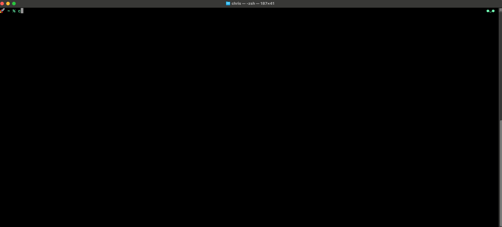

# Zsh Prompt Pet
Give your Zsh prompt a personality. A lightweight pet that reacts to your typos so that you don't have to.

<details>
  <summary>Click to reveal the Zsh Prompt Pet in action! (Spoiler Alert!)</summary>
  
  
</details>

### Features

* **Reactive Faces:** Your prompt face changes based on command exit status.
* **Failure Tracking:** Gets progressively angrier with consecutive failures.
* **Special Error Cases:** Unique faces for Permission Denied, Memory Errors, and "user not in sudoers" errors.
* **Customizable:** Use the `prompt-pet` command to change the default pet.
* **Lightweight:** A single file, no dependencies, doesn't require "oh-my-zsh".

---

### Installation

1.  **Clone the repository:**
    ```zsh
    git clone [https://github.com/YOUR_USERNAME/zsh-prompt-pet.git](https://github.com/YOUR_USERNAME/zsh-prompt-pet.git) ~/.zsh-prompt-pet
    ```

2.  **Source the file in your `~/.zshrc`:**
    Add this line to the end of your `~/.zshrc` file:
    ```zsh
    source ~/.zsh-prompt-pet/prompt-pet.zsh
    ```

3.  **Configure your `PROMPT`:**
    You *must* add `${PROMPT_PET_CURRENT_FACE}` to your `PROMPT` or `RPROMPT` (right prompt) variable in your `~/.zshrc`.
    
    **Example 1: Pet on the left**
    ```zsh
    # Put this *after* the source line
    PROMPT='${PROMPT_PET_CURRENT_FACE} %~%# '
    ```

    **Example 2: Pet on the right**
    ```zsh
    # Put this *after* the source line
    PROMPT='🚀 %~ %# '
    RPROMPT='${PROMPT_PET_CURRENT_FACE}'
    ```

4.  **Reload your shell:**
    ```zsh
    source ~/.zshrc
    ```
    
### Manual Install (Alternative)

If you don't want to clone, just copy the entire contents of `prompt-pet.zsh` and paste it at the end of your `~/.zshrc`, then configure your `PROMPT` as shown in Step 3.

---

### Usage

The prompt pet works automatically, but you can change the default face.

**Switch to a cat:**
```zsh
prompt-pet cat
```
*Default face becomes: `=^..^=`*

**Switch to a dog:**
```zsh
prompt-pet dog
```
*Default face becomes: `ˁ˚ᴥ˚ˀ`*

**Switch to a humanoid :**
```zsh
prompt-pet default
```
*Default face becomes: `●‿●`*

---

### The Moods
<details>
  <summary>Click to reveal the available moods (Spoiler Alert!)</summary>

| Condition | Face |
| --- | --- |
| **Default** | `●‿●` (or your custom pet) |
| 1 Failure | `( ಠ◡ಠ )` |
| 2 Failures | `(>‘o’)>` |
| 3 Failures | `(⋟﹏⋞)` |
| 4 Failures | `ლ( `Д’ ლ)` |
| 5-9 Failures | `(╯°□°)╯︵ ┻━┻` |
| 10+ Failures | `┻━┻︵ \(°□°)/ ︵ ┻━┻` |
| **Success after fail** | `ᕙ(⇀‸↼‶)ᕗ` (then back to default) |
| **Memory Error (untested)** (Exit 137) | `[¬º-°]¬` |
| **Permission Error (untested)** (Exit 126 or "sudoers") | `ʕಠᴥಠʔ ಠ_ಠ ᶘಠᴥಠᶅ` |

</details>
---

### License

This project is licensed under the MIT License - see the [LICENSE](LICENSE) file for details.